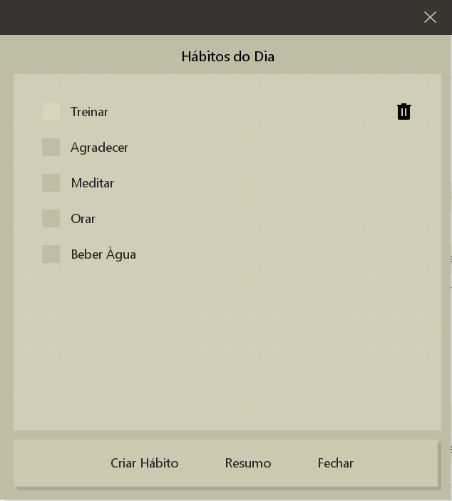
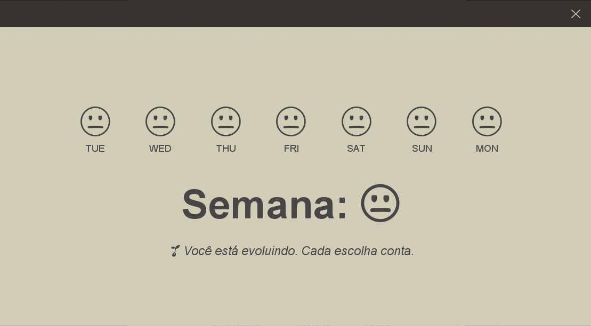

# 🌿 Spiritual Habits

Um aplicativo desktop minimalista e elegante para ajudar você a desenvolver hábitos diários conscientes e alinhados com uma vida mais equilibrada. Criado em **Java + Swing**, com visual zen e animações suaves inspiradas na estética mindfulness.

---

## ✨ Funcionalidades

- ✅ Marcação diária de hábitos com animação suave
- ➕ Cadastro de novos hábitos com pontuação e categoria
- 🗑️ Exclusão intuitiva com botão que aparece ao passar o mouse
- 📈 Resumo visual da semana em emojis (humor diário)
- 🌙 Interface minimalista com textura, sombra e tema flat
- 🎨 Estilização com FlatLaf, MigLayout e ícones SVG

---

## 📸 Preview





---

## 🚀 Como rodar o projeto

1. Clone o repositório:

```bash
git clone https://github.com/seu-usuario/spiritual-habits.git
```
